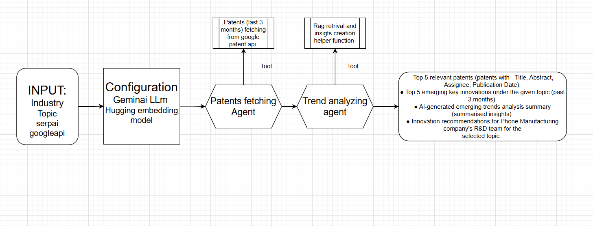

# AI-Powered Patent Analyzer

## 🚀 Project Overview
This project is an AI-powered **Patent Analysis System** that leverages **Hugging Face embeddings** and **LangChain agents** to retrieve, analyze, and visualize recent patents. It provides insights into emerging trends using **real-time AI processing** and an interactive **Streamlit web app**.
## 📷 Aechitecture

## 🔑 Key Features
- **Patent Retrieval:** Fetches recent patents from Google Patents using SerpAPI.
- **Embeddings & Storage:** Uses **Hugging Face embeddings** and stores vectors in **FAISS** for efficient retrieval.
- **AI-Powered Insights:** Implements **LangChain agents** to generate AI-based trend reports.
- **Multiple Implementations:**
  - **Hardcoded version** (baseline model)
  - **FastAPI version** (for API deployment)
  - **Streamlit web application** (for interactive use)
- **Visualization:** Generates **WordCloud** for a quick summary of key topics in patents.

## 📌 Technologies Used
- **Python, FAISS, LangChain, Sentence-Transformers, Hugging Face Embeddings**
- **Google Gemini API (optional) for LLM-based insights**
- **FastAPI** for API version
- **Streamlit** for web-based user interaction

## 🌐 Live Demo
🔗 [AI Patent Analyzer](https://aipatentanalyzer-c87jnzaupzwltnv4plhfde.streamlit.app/)

## 📂 How to Run Locally
1. **Clone the repository:**
   ```bash
   git clone https://github.com/yourusername/patent-analyzer.git
   cd patent-analyzer
   ```
2. **Install dependencies:**
   ```bash
   pip install -r requirements.txt
   ```
3. **Run the Streamlit App:**
   ```bash
   streamlit run app.py
   ```

## 📎 File Structure
```
📂 patent-analyzer
 ┣ 📂 embeddings_model        # Pre-trained embeddings model
 ┣ 📂 data                    # Cached patent data (JSON format)
 ┣ 📜 app.py                  # Main Streamlit application
 ┣ 📜 api.py                  # FastAPI implementation
 ┣ 📜 requirements.txt         # Dependencies
 ┣ 📜 README.md                # Project Documentation
```

## 🔥 Challenges Faced
1. **API Limits on Gemini** – Initially, I used Gemini API for LLM-based insights, but I had to switch to **Hugging Face embeddings** due to API rate limits.
2. **Efficient Data Storage** – Storing and retrieving insights efficiently required **FAISS indexing** to optimize patent search.
3. **Real-time Terminal Logs in Streamlit** – Capturing and displaying terminal logs dynamically was a challenge, which I resolved using **Streamlit's text area updates**.
4. **Deployment & Scalability** – Ensuring smooth deployment on **Streamlit** and **FastAPI** while maintaining performance.
5. **Effective Visualization** – Creating a meaningful **WordCloud** based on patent insights for better trend analysis.

## 📢 Future Improvements
- Integrate **real-time patent updates**
- Enhance **multi-language support** for broader accessibility
- Implement **improved ranking algorithms** for more relevant insights

## ✉️ Contact
For any queries, feel free to reach out:
📧 Email: [Your Email]
💼 LinkedIn: [Your LinkedIn Profile]

